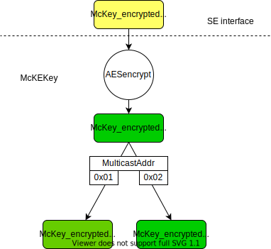

## Conventions

The key words "MUST", "MUST NOT", "REQUIRED", "SHALL", "SHALL NOT", "SHOULD", "SHOULD NOT", "RECOMMENDED”, “MAY", and “OPTIONAL" in this document are to be interpreted as described in RFC 2119.

The octet order over the air for all multi-octet fields is little endian (Least significant byte is sent first).


## Introduction

This document defines an application layer messaging package running over LoRaWAN to perform the following operations on a fleet of end-devices:
* Program a multicast distribution window into a group of end-devices
* Having all end-devices of the group switch to ClassB or ClassC temporarily at the beginning of the slot
* Close the distribution window and revert to normal operation (e.g. return to Class A, or change to a different periodicity in Class B)

All messages described in this document are transported as application layer messages. As such, all unicast messages (uplink or downlink) are encrypted by the LoRaWAN MAC layer using the end-device’s AppSKey. Downlink multicast messages are encrypted using a multicast group McAppSKey common to all end-devices of the group. The setup of the group as well as means to convey the MCAppSKey are described in the document.
The **“multicast control”** package can be used to:
-	Remotely create a multicast group security context inside a group of end-devices
-	Report the list of multicast context existing in the end-device
-	Remotely delete a multicast security context.
-	Program a classC multicast session
-	Program a classB multicast session

This package uses a dedicated port to separate its traffic from the rest of the applicative traffic.


## Multicast group context definition

This package makes the following assumptions.
Inside a given end-device a multicast group is defined by the following parameters (the multicast group context):

1. A McGroupID:  an integer in [0:3], the index of the multicast group. This index is used as an end-device specific shortcut to reference one of the multicast groups defined inside the end-device. An end-device supports a maximum of 4 simultaneous multicast groups, and a minimum of 0.
	
2. Multicast address:  the 4 bytes network address of the multicast group, common to all end-devices of the group. 
	
3. A multicast group key (McKey) from which are derived a McAppSKey and a McNwkSKey. The McKey is multicast group specific (different for every multicast group), but all end-devices of a given multicast group have the same McKey associated to this group 

4. A frame counter.
	
Because the end-device can be part of up to 4 multicast groups, every multicast control command MUST first define which multicast group is concerned by the command. To minimize the protocol overhead, a 2-bit McGroupID shortcut is used instead of the full 4 bytes multicast group network address in most of the commands defined in this package.An end-device MAY support up to 4 multicast groups contexts defined simultaneously. If an end-device supports N simultaneous multicast group contexts where 1<=N<=4 then the McGroupID can only be in the range [0:N-1].

```	
For example, if an end-device is designed to support only a single multicast group, 
then this group can only have McGroupID=0.
```
## Multicast Control Message Package

The identifier of the multicast control package is 2. The version of this package is version 1.

The following messages are sent to each end-device individually using Unicast downlink on a port specifically used for the multicast package. It is RECOMMNEDED that a default port value of 200 be used to promote interoperability, though implementations MAY use a value from those not assigned by the Alliance (see [TS008] FPort Assignments). These messages MUST NOT be sent using multicast. If these messages are received on a multicast address the end-device MUST drop them silently.


All unicast control messages use the same format:
<table>
  <tr> <td>Command1</td> <td>Command1 Payload</td> <td>Command2</td> <td>Command2 payload</td> <td>....</td> </tr>
</table>

A message MAY carry more than one command. The length of each command’s payload is fixed and a function of the command. Commands are executed from first to last. Each command MUST be individually acknowledged by the end-device.

The following table summarizes the list of multicast control messages

<table>
    <caption>Multicast Control messages summary </caption>
    <thead>
        <tr>
            <th>CID</th>
            <th>Command name</th>
            <th>Transmitted by end-device</th>
            <th>Transmitted by Server</th>
            <th>Short Description</th>
        </tr>
    </thead>
    <tbody>
        <tr>
            <td>0x00</td>
            <td>PackageVersionReq</td>
            <td></td>
            <td>x</td>
            <td>Used by the AS to request the package version implemented by the end-device</td>
        </tr>
	    <tr>
            <td>0x00</td>
            <td>PackageVersionAns</td>
            <td>x</td>
            <td></td>
            <td>Conveys the answer to PackageVersionReq</td>
        </tr>
        <tr>
            <td>0x01</td>
            <td>McGroupStatusReq</td>
            <td></td>
            <td>x</td>
            <td>Asks an end-device to list the multicast groups currently configured</td>
        </tr>
	<tr>
            <td>0x01</td>
            <td>McGoupStatusAns</td>
            <td>x</td>
            <td></td>
            <td>Conveys answer to the McGroupStatus request</td>
        </tr>
        <tr>
            <td>0x02</td>
            <td>McGroupSetupReq</td>
            <td></td>
            <td>x</td>
            <td>Provides an end-device will all necessary information to join a multicast group</td>
        </tr>
        <tr>
            <td>0x02</td>
            <td>McGroupSetupAns</td>
            <td>x</td>
            <td></td>
            <td></td>
        </tr>
	<tr>
            <td>0x03</td>
            <td>McGroupDeleteReq</td>
            <td></td>
            <td>x</td>
            <td>Used to delete a multicast group from an end-device</td>
        </tr>
	 <tr>
            <td>0x03</td>
            <td>McGroupDeleteAns</td>
            <td>x</td>
            <td></td>
            <td></td>
        </tr>
	 <tr>
            <td>0x04</td>
            <td>McClassCSessionReq</td>
            <td></td>
            <td>x</td>
            <td>Conveys information about the next classC multicast session the end-device shall join</td>
        </tr>
	 <tr>
            <td>0x04</td>
            <td>McClassCSessionAns</td>
            <td>x</td>
            <td></td>
            <td></td>
        </tr>
	 <tr>
            <td>0x05</td>
            <td>McClassBSessionReq</td>
            <td></td>
            <td>x</td>
            <td>Creates a class B multicast session </td>
        </tr>
	 <tr>
            <td>0x05</td>
            <td>McClassBSessionAns</td>
            <td>x</td>
            <td></td>
            <td></td>
        </tr>
    </tbody>
</table>

### PackageVersionReq & Ans

The **_PackageVersionReq** command has no payload.
The end-device answers with a **_PackageVersionAns_** command with the following payload.

<table>
    <caption>PackageVersionAns</caption>
    <tbody>	
        <tr>
            <td>Field</td>
	    <td>PackageIdentifier</td>	
	    <td>PackageVersion</td>
        </tr>
        <tr>
            <td>Size(bytes)</td>          
            <td>1</td>
	    <td>1</td>
        </tr>
     </tbody>
</table>

*PackageIdentifier uniquely* identifies the package. For the “multicast control package” this identifier is 2.

*PackageVersion* corresponds to the version of the package specification implemented by the end-device. 

### McGroupStatusReq & Ans

The McGroupStatusReq command has a single byte payload.

<table>
    <caption>McGroupStatusReq </caption>
    <thead>
        <tr>
            <th>Field</th>
            <th>Size(bytes)</th>
        </tr>
        <tr>
            <td>CmdMask</td>
            <td>1</td>
        </tr>
    </tbody>
</table>

Where:

<table>
    <caption>McGroupStatusReq CmdMask field</caption>
    <tbody>
	<tr>
	  <td><strong>CmdMask Fields</strong></td>
	  <td>RFU</td>
	  <td>RegGroupMask</td>
	</tr>
	<tr>
	  <td><strong>Size (bits)</strong></td>
	  <td>4bits</td>
	  <td>4 bits</td>
	</tr>
    </tbody>
</table>

The *ReqGroupMask* bit mask defines the multicast groups whose status should be reported by the end-device.  ReqGroupMask[n] = 1 means that the nth multicast group status SHOULD be included in the answer. ReqGroupMask[n] = 0 means that this group SHALL NOT be included in the answer.

The end-device responds to the McGroupStatusReq command with a McGroupStatusAns with the following payload:

<table>
    <caption> McGroupStatusAns</caption>
    <thead>
        <tr>
            <th>Field</th>
            <th>Size(bytes)</th>
        </tr>
        <tr>
            <td>status</td>
            <td>1</td>
        </tr>
	 <tr>
            <td>Optional list of [McGroupID+McAddr]</td>
            <td>5xNbItems</td>
        </tr>
    </tbody>
</table>

The status field encodes the following information:

<table>
    <caption>McGroupStatusAns Status field</caption>
    <thead>
        <tr>
            <th>Status Fields</th>
            <th>Size(bits)</th>
        </tr>
        <tr>
            <td>RFU</td>
            <td>1 bit</td>
        </tr>
	 <tr>
            <td>NbTotalGroups</td>
            <td>3bits</td>
        </tr>
	 <tr>
            <td>AnsGroupMask</td>
            <td>4bits</td>
        </tr>
    </tbody>
</table>

*AnsGroupMask* is a bit mask describing which groups are listed in the report. If the end-device cannot report the status of the multicast groups specified by the *ReqGroupMask* field of the request, the end-device SHALL discard the nth last groups (starting with the highest GroupID) until the answer fits. In that case, the *AnsGroupMask* mask is different from the *ReqGroupMask*. In that case the server can get the status of the groups not listed by issuing a new McGroupStatusReq command with another *RegGroupMask* field.  If all groups requested can be listed, *AnsGroupMask8* == *ReqGroupMask*.

*NbTotalGroups* is the number of multicast groups currently defined in the end-device. The valid range is [0:4].

Each record consists of 5 bytes [McGroupID + McAddr].
McGroupID and McAddr are provided to the end-device by McGroupSetupReq.

### McGroupSetupReq & Ans

This command is used to create or modify the parameters of a multicast group.
The payload of the message is:

<table>
    <caption>McGroupSetupReq</caption>
    <thead>
        <tr>
            <th>Field</th>
            <th>Size(bytes)</th>
        </tr>
        <tr>
            <td>McGroupIDHeader</td>
            <td>1</td>
        </tr>
	 <tr>
            <td>McAddr</td>
            <td>4</td>
        </tr>
	 <tr>
            <td>McKey_encrypted</td>
            <td>16</td>
        </tr>
	  <tr>
            <td>minMcFCount</td>
            <td>4</td>
        </tr>
	 <tr>
            <td>maxMcFCount</td>
            <td>4</td>
        </tr>
    </tbody>
</table>

Where:

<table>
    <caption>McGroupSetupReq McGroupIDHeader field</caption>
    <thead>
        <tr>
            <th>McGroupIDHeader Fields</th>
            <th>Size(bits)</th>
        </tr>
        <tr>
            <td>RFU</td>
            <td>6 bits</td>
        </tr>
	 <tr>
            <td>McGroupID</td>
            <td>2 bits</td>
        </tr>
    </tbody>
</table>

*McGroupID* is the multicast group ID of the multicast context. An end-device MAY support being part of several multicast group simultaneously. Therefore, all multicast related command MUST always contain an identifier (the McGroupID) of the multicast group being affected. 

```
Note: The McAddr could be used as a multicast group identifier but this would add a systematic 4
bytes overhead, so a more compact McGroupID is used. Additionally, if MultiCast keys are kept in a
Hardware Secure Element that can only keep a few keys, the MCU needs to indicate which key memory
slot should be used. Therefore, the Multicast group ID concept is required.
```
An end-device implementing this package SHALL support at least one multicast group. An end-device MAY support up to a maximum of 4 simultaneous multicast contexts.

*McKey_encrypted* is the encrypted multicast group key from which McAppSKey and McNetSKey will be derived. The McKey_encrypted key can be decrypted using the following operation to give the multicast group’s McKey.
	McKey = aes128_encrypt(McKEKey, McKey_encrypted)

The McKEKey is a __**lifetime end-device specific**__ key used to encrypt Multicast key transported over the air (it is a Key Encryption Key), and may be either:

* Derived from a new root key (GenAppKey) provisioned in the end-device at any time before the deployment of the end-device in the field. LoRaWAN 1.0.x end-devices SHALL use this scheme. 
  * McRootKey = aes128_encrypt(GenAppKey, 0x00 | pad16)
  * McKEKey = aes128_encrypt(McRootKey, 0x00 | pad16)

* Derived from the AppKey.  LoRaWAN 1.1+ end-devices SHALL use this scheme.
  * McRootKey = aes128_encrypt(AppKey, 0x20 | pad16)
  * McKEKey = aes128_encrypt(McRootKey, 0x00 | pad16)
  
The McAppSKey and the McNetSKey are then derived from the group’s McKey as follow:

McAppSKey = aes128_encrypt(McKey, 0x01 | McAddr | pad16)
McNetSKey = aes128_encrypt(McKey, 0x02 | McAddr | pad16)

The multicast key derivation scheme is summarized in the following diagram.

<figure class="text-center">
      
      <figcaption>The multicast key derivation scheme</figcaption>
</figure>

```
Note: using a Key Encryption Key to transport the multicast group McKey allows for a completely
secure multicast scheme when using a hardware secure element, when the secure element does not export
the McKey, McAppSKey, and McNwkSKey to the outside. It does not increase the security if a full
software implementation is used in the end-device. However, for compatibility reason it is
recommended to systematically use this scheme.
```

The *minMcFCount* field is the next frame counter value of the multicast downlink to be sent by the server for this group. This information is required in case an end-device is added to a group that already exists. The end-device MUST reject any downlink multicast frame using this group multicast address if the frame counter is < minMcFCount. 

*McAddr* is the multicast group network address. McAddr is negotiated off-band by the application server with the network server.

*maxMcFCount* specifies the life time of this multicast group expressed as a maximum number of frames. The end-device will only accept a multicast downlink frame if the 32bits frame counter value minMcFCount ≤ McFCount < maxMcFCount.

The end-device acknowledges the reception of this message by sending an **_McGroupSetupAns_** message with the following payload:

<table>
    <caption>McGroupSetupAns</caption>
    <thead>
        <tr>
            <th>Field</th>
            <th>Size (bytes)</th>
        </tr>
	<tr>
            <td>McGroupIDHeader</td>
            <td>1</td>
        </tr>
    </tbody>
</table>

Where:

<table>
    <caption>McGroupSetupAns McGroupIDHeader field</caption>
    <thead>
        <tr>
            <th>McGroupIDHeader Fields</th>
            <th>Size (bytes)</th>
        </tr>
        <tr>
            <td>RFU</td>
            <td>5</td>
        </tr>
	 <tr>
            <td>IDerror</td>
            <td>1</td>
        </tr>
	 <tr>
            <td>McGroupID</td>
            <td>2</td>
        </tr>
    </tbody>
</table>

When set the *IDerror* bit indicates that the end-device does not support the multicast context indexed by the McGroupID requested by the server. For example, an end-device MAY only support a single multicast group (McGroupID=0). If the server tries to create a second multicast group with McGroupID = 1, the end-device SHALL respond with IDerror=1.

### McGroupDeleteReq & Ans

This message is used to delete a multicast group from an end-device. The command payload is:

<table>
    <caption>McGroupDeleteReq</caption>
    <thead>
        <tr>
            <th>Field</th>
            <th>Size (bytes)</th>
        </tr>
        <tr>
            <td>McGroupIDHeader</td>
            <td>1</td>
        </tr>
    </tbody>
</table>

Where:

<table>
    <caption>McGroupDeleteReq McGroupIDHeader field</caption>
    <thead>
        <tr>
            <th>McGroupIDHeader Fields</th>
            <th>Size (bits)</th>
        </tr>
        <tr>
            <td>RFU</td>
            <td>6bits</td>
        </tr>
	<tr>
            <td>McGroupID</td>
            <td>2bits</td>
        </tr>
    </tbody>
</table>

The end-device answers with **McGroupDeleteAns** with payload:

<table>
    <caption>McGroupDeleteAns</caption>
    <thead>
        <tr>
            <th>Field</th>
            <th>Size (bytes)</th>
        </tr>
        <tr>
            <td>McGroupIDHeader</td>
            <td>1</td>
        </tr>
    </tbody>
</table>

Where:

<table>
    <caption>McGroupDeleteAns McGroupIDHeader field</caption>
    <thead>
        <tr>
            <th>McGroupIDHeader Fields</th>
            <th>Size (bits)</th>
        </tr>
        <tr>
            <td>RFU</td>
            <td>5bits</td>
        </tr>
	<tr>
            <td>MCGroupUndefined</td>
            <td>1bit</td>
        </tr>
	 <tr>
            <td>McGroupID</td>
            <td>2bits</td>
        </tr>
    </tbody>
</table>

*MCGroupUndefined* is set 1 if the McGroupID specified by the command is not defined in the end-device (was not created before calling the delete command).

### McClassCSessionReq & Ans

This message is only used to setup a temporary classC multicast session associated with a multicast context. 

The payload of the message is:

<table>
    <caption>McClassCSessionReq</caption>
    <thead>
        <tr>
            <th>Field</th>
            <th>Size (bytes)</th>
        </tr>
        <tr>
            <td>McGroupIDHeader</td>
            <td>1</td>
        </tr>
	<tr>
            <td>Session Time</td>
            <td>4</td>
        </tr>
	 <tr>
            <td>SessionTimeOut</td>
            <td>1</td>
        </tr>
	 <tr>
            <td>DLFrequ</td>
            <td>3</td>
        </tr>
	 <tr>
            <td>DR</td>
            <td>1</td>
        </tr>
    </tbody>
</table>

Where:

<table>
    <caption>McClassCSessionReq McGroupIDHeader field</caption>
    <thead>
        <tr>
            <th>McGroupIDHeader Fields</th>
            <th>Size (bits)</th>
        </tr>
        <tr>
            <td>RFU</td>
            <td>6bits</td>
        </tr>
	<tr>
            <td>McGroupID</td>
            <td>2bits</td>
        </tr>
    </tbody>
</table>

And where:

<table>
    <caption>McClassCSessionReq SessionTimeOut field</caption>
    <thead>
        <tr>
            <th>SessionTimeOut Fields</th>
            <th>Size (bits)</th>
        </tr>
        <tr>
            <td>RFU</td>
            <td>4bits</td>
        </tr>
	<tr>
            <td>TimeOut</td>
            <td>4bits</td>
        </tr>
    </tbody>
</table>

*McGroupID* is the identifier of the multicast group being used.

*SessionTime* is the start of the Class C window, and is expressed as the time in seconds since 00:00:00, Sunday 6th of January 1980 (start of the GPS epoch) modulo 2^32. Note that this is the same format as the Time field in the beacon frame.

*TimeOut* encodes the maximum length in seconds of the multicast session (max time the end-device stays in classC before reverting to class A to save battery)
The maximum duration in second is 2TimeOut (Example: TimeOut=8 means 256 seconds)
This is a maximum duration because the end-device’s application might decide to revert to class A before the end of the session, this decision is application specific. 

```
For example, the multicast session might be used to broadcast a firmware upgrade file. In that case
the end-device might end the multicast session has soon as the full file is received without waiting
for TimeOut.
```

*DlFrequ:* Encodes the frequency used for the multicast. This field is a 24 bits unsigned integer. The actual channel frequency in Hz is 100 x DlFrequ whereby values representing frequencies below 100 MHz are reserved for future use. This allows setting the frequency of a channel anywhere between 100 MHz to 1.67 GHz in 100 Hz steps.
This field has the same meaning and coding as LoRaWAN *NewChannelReq* MAC command ‘Freq’ field.

*DR:* index of the data rate used for the multicast. Uses the same look-up table than the one used by the LinkAdrReq MAC command of the LoRaWAN protocol.

The end-device acknowledges the reception of this message by sending a **McClassCSessionAns** message on the same port with the following payload:

<table>
    <caption>McClassCSessionAns</caption>
    <thead>
        <tr>
            <th>Field</th>
            <th>Size (bytes)</th>
        </tr>
        <tr>
            <td>Status&McGroupID</td>
            <td>1</td>
        </tr>
	<tr>
            <td>(cond)TimeToStart</td>
            <td>3</td>
        </tr>
    </tbody>
</table>

Where:

<table>
    <caption>McClassCSessionAns Status&McGroupID field</caption>
    <thead>
        <tr>
            <th>Status&McGroupID Fields</th>
            <th>Size (bits)</th>
        </tr>
        <tr>
            <td>RFU</td>
            <td>3bits</td>
        </tr>
	<tr>
            <td>McGroupUndefined</td>
            <td>1bit</td>
        </tr>	
	<tr>
            <td>FreqError</td>
            <td>1bit</td>
        </tr>	
	 <tr>
            <td>DRError</td>
            <td>1bit</td>
        </tr>	
	 <tr>
            <td>McGroupID</td>
            <td>1bit</td>
        </tr>
    </tbody>
</table>

*FreqError* bit is set to 1 if the DLFrequ frequency set by the network is not usable for the end-device.

*DRError* bit is set to 1 if the classC downlink Data Rate set by the network is not defined.

*McGroupUndefined* is set 1 if the McGroupID specified by the command is not defined in the end-device (was not created before calling this command).

If no errors are present, the *TimeToStart* field encodes the number of seconds from the **_McClassCSessionAns_** uplink to the beginning of the multicast session. This allows the server to check that the end-device clock is well synchronized and that the end-device will effectively switch to classC exactly at the right moment (with second accuracy). This is possible because all uplinks are accurately time stamped by the network gateways (at least with an accuracy better than the second).

### McClassBSessionReq & Ans

This message is only used to setup a temporary ClassB multicast session associated with a multicast context. 
The payload of the message is:

<table>
    <caption>McClassBSessionReq</caption>
    <thead>
        <tr>
            <th>Field</th>
            <th>Size (bytes)</th>
        </tr>
	<tr>
            <td>McGroupIDHeader</td>
            <td>1</td>
        </tr>	
	<tr>
            <td>Session Time</td>
            <td>4</td>
        </tr>	
	 <tr>
            <td>TimeOutPeriodicity</td>
            <td>1</td>
        </tr>	
	 <tr>
            <td>DLFrequ</td>
            <td>3</td>
        </tr>
	<tr>
            <td>DR</td>
            <td>1</td>
        </tr>
    </tbody>
</table>

Where:

<table>
    <caption>McClassBSessionReq McGroupIDHeader field</caption>
    <thead>
        <tr>
            <th>McGroupIDHeader Fields</th>
            <th>Size (bits)</th>
        </tr>
        <tr>
            <td>RFU</td>
            <td>6bits</td>
        </tr>
	<tr>
            <td>McGroupID</td>
            <td>2bits</td>
        </tr>	
    </tbody>
</table>

And where:

<table>
    <caption>McClassBSessionReq TimeOutPeriodicity field</caption>
    <thead>
        <tr>
            <th>TimeOutPeriodicity Fields</th>
            <th>Size (bits)</th>
        </tr>
        <tr>
            <td>RFU</td>
            <td>1bits</td>
        </tr>
	<tr>
            <td>Periodicity</td>
            <td>3bits</td>
        </tr>
	<tr>
            <td>TimeOut</td>
            <td>4bits</td>
        </tr>
    </tbody>
</table>

*McGroupID* is the identifier of the multicast group being used.

*SessionTime* is the start of the Class B window, and is expressed as the time in seconds since 00:00:00, Sunday 6th of January 1980 (start of the GPS epoch) modulo 2^32. Note that this is the same format as the Time field in the beacon frame. SessionTime MUST be an integer multiple of 128.

*TimeOut* encodes the maximum length in BeaconPeriods (128seconds) of the multicast fragmentation session (max time the end-device stays in classB before eventually reverting to class A to save battery)
The maximum duration in second is 128*2TimeOut (Example: TimeOut=8 corresponds roughly to 9.1hours).

```
Attention: For classB TimeOut is expressed in BeaconPeriod (128sec), whereas it is expressed in 
seconds for classC. This is because a classB multicast session is heavily duty-cycled and is likely
to last a lot longer than a classC session.
```
This is a maximum duration because the end-device’s application might decide to revert to class A before the end of the session, this decision is application specific. 

*Periodicity* encodes the classB ping slot periodicity for the multicast group. The encoding format is the same than for the Periodicity field of the **_PingSlotInfoReq_** classB MAC command defined in LoRaWAN.

*DlFrequ*: Encodes the frequency used for the multicast. This field is a 24 bits unsigned integer. The actual channel frequency in Hz is 100 x DlFrequ whereby values representing frequencies below 100 MHz are reserved for future use. This allows setting the frequency of a channel anywhere between 100 MHz to 1.67 GHz in 100 Hz steps. 
This field has the same meaning and coding as LoRaWAN *NewChannelReq* MAC command 'Freq' field.

In regions where the classB beacon is transmitted following a frequency hopping pattern, DlFrequ=0 signals the end-device to use the default classB default frequency hopping scheme. That scheme is defined in the classB section of the LoRaWAN specification. In that case, Class B downlinks use a channel which is a function of the Time field of the last beacon (see Beacon Frame content) and the multicast address McAddr.

```
Class B downlink channel=[McAddr+floor ((Beacon_Time )/(Beacon_period))] modulo NbChannel
```
* Whereby Beacon_Time is the 32-bit Time field of the current beacon period
* Beacon_period is the length of the beacon period (defined as 128sec in the specification)
* Floor designates rounding to the immediately lower integer value
* McAddr is the 32-bit network address of the multicast group
* NbChannel is the number of channel over which the beacon is frequency hopping
 
*DR*: index of the data rate used for the classB multicast. Uses the same look-up table than the one used by the LinkAdrReq MAC command of the LoRaWAN protocol.

The end-device acknowledges the reception of this message by sending a **_McClassBSessionAns** message on the same port with the following payload:

<table>
    <caption>McClassBSessionAns</caption>
    <thead>
        <tr>
            <th>Field</th>
            <th>Size (bytes)</th>
        </tr>
        <tr>
            <td>Status&McGroupID</td>
            <td>1</td>
        </tr>
	<tr>
            <td>(cond)TimeToStart</td>
            <td>3</td>
        </tr>
    </tbody>
</table>

Where:

<table>
    <caption>McClassBSessionAns Status&McGroupID field</caption>
    <thead>
        <tr>
            <th>Field</th>
            <th>Size (bits)</th>
        </tr>
        <tr>
            <td>RFU</td>
            <td>3bits</td>
        </tr>
	<tr>
            <td>McGroupUndefined</td>
            <td>1bit</td>
        </tr>
	<tr>
            <td>FreqError</td>
            <td>1bit</td>
        </tr>
	<tr>
            <td>DRError</td>
            <td>1bit</td>
        </tr>
	<tr>
            <td>McGroupID</td>
            <td>2bit</td>
        </tr>
    </tbody>
</table>

*FreqError* bit is set to 1 if the DLFrequ frequency set by the network is not usable for the end-device.

*DRError* bit is set to 1 if the classB downlink Data Rate set by the network is not defined.

*McGroupUndefined* is set 1 if the McGroupID specified by the command is not defined in the end-device (was not created before calling this command).

If no errors are present, the TimeToStart field encodes the number of seconds from the **_McClassBSessionAns_** uplink to the beginning of the multicast fragmentation session. This allows the server to check that the end-device clock is roughly synchronized and that it will effectively start acquiring the classB beacon at the right moment (before the beginning of the classB multicast session with some margin).

## Glossary


<table>
    <caption>Glossary</caption>
    <thead>
        <tr>
            <th>Abbriviation</th>
            <th>Meaning</th>
        </tr>
        <tr>
            <td>AS</td>
            <td>Application Server</td>
        </tr>
	<tr>
            <td>TBD</td>
            <td>To Be Done</td>
        </tr>
    </tbody>
</table>

## Bibliography 

### References

[LoRaWAN 1.0.2]: LoRaWANTM 1.0.2 Specification, LoRa Alliance, July 2016

[LoRaWAN 1.1]: LoRaWANTM 1.1 Specification, LoRa Alliance, October 11, 2017

[TS008]: LoRaWANTM LoRa Alliance Assigned Number Registry v0.0.4, May 28, 2019
## NOTICE OF USE AND DISCLOSURE

Copyright © LoRa Alliance, Inc. (2018). All Rights Reserved.

The information within this document is the property of the LoRa Alliance (“The Alliance”) and its use and disclosure are subject to LoRa Alliance Corporate Bylaws, Intellectual Property Rights (IPR) Policy and Membership Agreements.

Elements of LoRa Alliance specifications may be subject to third party intellectual property rights, including without limitation, patent, copyright or trademark rights (such a third party may or may not be a member of LoRa Alliance). The Alliance is not responsible and shall not be held responsible in any manner for identifying or failing to identify any or all such third party intellectual property rights.

This document and the information contained herein are provided on an “AS IS” basis and THE ALLIANCE DISCLAIMS ALL WARRANTIES EXPRESS OR IMPLIED, INCLUDING BUT NOT LIMITED TO (A) ANY WARRANTY THAT THE USE OF THE INFORMATION HEREIN WILL NOT INFRINGE ANY RIGHTS OF THIRD PARTIES (INCLUDING WITHOUT LIMITATION ANY INTELLECTUAL PROPERTY RIGHTS INCLUDING PATENT, COPYRIGHT OR TRADEMARK RIGHTS) OR (B) ANY IMPLIED WARRANTIES OF MERCHANTABILITY, FITNESS FOR A PARTICULAR PURPOSE, TITLE OR NONINFRINGEMENT.

IN NO EVENT WILL THE ALLIANCE BE LIABLE FOR ANY LOSS OF PROFITS, LOSS OF BUSINESS, LOSS OF USE OF DATA, INTERRUPTION OFBUSINESS, OR FOR ANY OTHER DIRECT, INDIRECT, SPECIAL OR EXEMPLARY, INCIDENTIAL, PUNITIVE OR CONSEQUENTIAL DAMAGES OF ANY KIND, IN CONTRACT OR IN TORT, IN CONNECTION WITH THIS DOCUMENT OR THE INFORMATION CONTAINED HEREIN, EVEN IF ADVISED OF THE POSSIBILITY OF SUCH LOSS OR DAMAGE. 

The above notice and this paragraph must be included on all copies of this document that are made.

LoRa Alliance™
5177 Brandin Court
Fremont, CA 94538
United States

Note: All Company, brand and product names may be trademarks that are the sole property of their respective owners.
