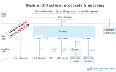

## Scope

```
Define as it relates to Open Manufacturing Platform Activity. If it adds clarity, define what is not in the scope. DELETE THIS COMMENT 
```

## References
### Normative References

```
The policy for reference lists is:
1. OMP documents listed should have at least one approved version – draft-only docs should not be referenced.
Exception exists for documents that will be approved with or after the referenced doc is approved (may be part of same enabler package). In short – approved docs should not reference unapproved docs.
2. When a reference is made to an OMP specification, then Open Manufacturing Platform with the TM symbol (™) should 
be used in the description.
3. The name + version (no date) for OMP specifications are generally sufficient – dates should be used only if there is a specific reason to limit the usage.
4. References to other affiliate docs should similarly provide sufficient information to uniquely determine the needed document and should provide the appropriate source information.
5. The URL for OMP material (new OMP and affiliate) should always be http://www.openmanufacturingplatform.org.
    
Models to use:
	[REFLABEL]	<General Model> "Ref Title", Ref information (source, date, id), URL:http//<ref-source>/ 
	[OMPDOC]	<OMP Model> "OMP Document Title",{ Version x.y,} Open Manufacturing Platform™, OMP <docname>{    <version>}, URL:http//www.openmobilealliance.org/ 

If there are no entries in the table – enter ‘none’ to be clear.

DELETE THIS COMMENT
```
<table>
  <caption>Normative References </caption>
  <tbody>
    <tr>
      <td><strong>[RFC2119]</strong></td>
      <td>"Key words for use in RFCs to Indicate Requirement Levels", S. Bradner, March 1997, URL:http://www.ietf.org/rfc/rfc2119.txt</td>
    </tr>
    <tr>
      <td><strong>[RFC5234]</strong></td>
      <td>"Augmented BNF for Syntax Specifications: ABNF", D. Crocker, Ed., P. Overell, Janury 2008, URL: https://tools.ietf.org/rfc/rfc5234.txt</td>
    </tr>
  </tbody>
</table>

```
Add/Remove reference rows as needed - DELETE This Row 
```

### Informative References

<table>
  <caption>Informative References </caption>
  <tbody>
    <tr>
      <td><strong>[OMPDICT]</strong></td>
      <td>"Dictionary for OMP Specifications", Version x.y, Open Manufacturing Platform™, OMP-ORG-Dictionary-Vx_y, URL:http://www.openmanufacturingplatform.org/</td>
    </tr>
  </tbody>
</table>

```
Add/Remove references as needed - DELETE This Row
```

## Terminology and Conventions
### Conventions

The key words "MUST", "MUST NOT", "REQUIRED", "SHALL", "SHALL NOT", "SHOULD", "SHOULD NOT", "RECOMMENDED", "MAY", and "OPTIONAL" in this document are to be interpreted as described in [RFC2119].

All sections and appendixes, except "Scope" and "Introduction", are normative, unless they are explicitly indicated to be informative.

```
If needed, describe or declare using appropriate normative references the additional conventions that are used.  DELETE THIS COMMENT
```

### Definitions

```
Add definitions in new rows of the following table as needed. The following examples show how dictionary references should be made as well as locally defined terms. This table should be maintained in sorted alphabetic order based on the labels of the terms.

Examples:
	Entity              Use definition #1 from [OMPDICT]
	Interactive Service Use definition from [OMPDICT]
	Local Term          The definition description would be presented directly

DELETE THIS COMMENT
```
<table>
  <caption>Definitions</caption>
  <tbody>
  <tr>
	  <td><strong>Cloud computing</strong></td>
	  <td>Paradigm for enabling network access to a scalable and elastic pool of shareable physical or virtual resources with self-service provisioning and administration on-demand.</br>
    Note: examples of resources include servers, operating systems, networks, software, applications and storage equipment.</td>
  </tr>
  <tr>
	  <td><strong>Connectivity</strong></td>
	  <td>Ability of a system or application to communicate with other systems or applications via network(s). </td>
  </tr>
  <tr>
	  <td><strong>Connectivity endpoint</strong></td>
	  <td>Interface that provides connectivity.</td>
  </tr>
  <tr>
	  <td><strong>Data</strong></td>
	  <td>Content represented in a digital and formalized manner suitable for communication, storage, interpretation or processing.</td>
  </tr>
  <tr>
	  <td><strong>Digital representation</strong></td>
	  <td>Information that represents attributes and behaviors of an entity.</td>
  </tr>
  <tr>
	  <td><strong>Digital twin</strong></td>
	  <td>Digital representation, sufficient to meet the requirements of a set of use cases.</br>
        Note: in this context, the entity in the definition of digital representation is typically an asset, process or system.</td>
  </tr>
  <tr>
	  <td><strong>Edge</strong></td>
	  <td>Boundary between the pertinent digital and physical entities, delineated by IoT devices.</td>
  </tr>
  <tr>
	  <td><strong>Edge computing</strong></td>
	  <td>Distributed computing that is performed near the edge, where the nearness is determined by the system requirements.</td>
  </tr>
  <tr>
	  <td><strong>Element</strong></td>
	  <td>Entity that is indivisible at a given level of abstraction and has a clearly defined boundary.</td>
  </tr>
  <tr>
	  <td><strong>Endpoint</strong></td>
	  <td>Component that has computational capabilities and network connectivity.</td>
  </tr>
  <tr>
	  <td><strong>Entity</strong></td>
	  <td>Item that has recognizably distinct existence.</br>
        Note: e.g. a person, an organization, a device, a subsystem or a group of such items.</td>
  </tr>
  <tr>
	  <td><strong>Industrial control system (ICS)</strong></td>
	  <td>Combination of control components that act together to exercise control in the physical world.</td>
  </tr>
  <tr>
	  <td><strong>Industrial internet</strong></td>
	  <td>Internet of things, machines, computers and people, enabling intelligent industrial operations using advanced data analytics for transformational business outcomes</td>
  </tr>
  <tr>
	  <td><strong>Industrial internet of things (IIoT) system</strong></td>
	  <td>System that connects and integrates industrial control systems with enterprise systems, business processes and analytics.</br>
    Note 1: Industrial control systems contain sensors and actuators.</br>
    Note 2: typically, these are large and complicated systems.</td>
  </tr>
  <tr>
	  <td><strong>Information</strong></td>
	  <td>Data that within a certain context has a particular meaning.</td>
  </tr>
  <tr>
	  <td><strong>Infrastructure service</strong></td>
	  <td>Service that is essential for any IoT implementation to work properly.</br>
    Note: Infrastructure services provide support for essential features of the IoT.</td>
  </tr>
  <tr>
	  <td><strong>Interface</strong></td>
	  <td>Named set of operations that characterize the behavior of an entity.</td>
  </tr>
  <tr>
	  <td><strong>Interoperability</strong></td>
	  <td>Ability of two or more systems or applications to exchange information and to mutually use the information that has been exchanged.</td>
  </tr>
  <tr>
	  <td><strong>IoT actuator</strong></td>
	  <td>IoT device that can change one or more properties of a physical entity in response to received information</td>
  </tr>
  <tr>
	  <td><strong>IoT device</strong></td>
	  <td>Endpoint that interacts with the physical world through sensing or actuating.</td>
  </tr>
  <tr>
	  <td><strong>IoT sensor</strong></td>
	  <td>IoT device that observes one or more properties of a physical entity and converts those properties into information.</td>
  </tr>
  <tr>
	  <td><strong>Network</strong></td>
	  <td>Collection of communicating endpoints.</td>
  </tr>
  <tr>
	  <td><strong>Physical entity</strong></td>
	  <td>Entity in the physical world that can be the subject of sensing and/or actuating.</td>
  </tr>
  <tr>
	  <td><strong>Physical entity of interest</strong></td>
	  <td>Physical entity that is the subject of sensing and/or actuating.</td>
  </tr>
  <tr>
	  <td><strong>Process</strong></td>
	  <td>Type of composition whose elements are composed into a sequence or flow of activities and interactions with the objective of carrying out certain work.</br>
    Note: a process may also be a collaboration, choreography or orchestration.</td>
  </tr>
  <tr>
	  <td><strong>Programmable logic controller (PLC)</strong></td>
	  <td>Electronic device designed for control of the logical sequence of events.</td>
  </tr>
  <tr>
	  <td><strong>Semantic interoperability</strong></td>
	  <td>Interoperability such that the meaning of the exchanged information can be understood by the participating systems.</td>
  </tr>
  <tr>
	  <td><strong>Service</strong></td>
	  <td>Distinct part of the functionality that is provided by an entity through interfaces.</td>
  </tr>
  <tr>
	  <td><strong>Syntactic interoperability</strong></td>
	  <td>Interoperability such that the formats of the exchanged information can be understood by the participating systems.</td>
  </tr>  
  </tbody>
</table>

### Abbreviations

```
Add abbreviations as needed. No special notation should be made regarding terms copied from the Dictionary.  
The list should be maintained in alphabetic order. DELETE This Row
```

<table>
<caption>Definitions</caption>
<tbody>
  <tr>
    <td>OMP</td>
    <td>Open Manufacturing Platform</td>
  </tr>
</tbody>
</table>

## Introduction

```
From a market perspective...  

* What can you do with this specification?
* What problem does this solve?
* How can this specification be applied?
* Consider the target audience and provide deployment examples as possible.

DELETE THIS COMMENT
```

### Version 1.0

```
This section provides a high level, concise and informative description of the main functionality supported in 
the initial version of the specification. The description should be brief, target length should be a few paragraphs. 
When the enabler or reference release is finished, this description should be aligned with the final functionality. 

DELETE THIS COMMENT
```
## Architecture and Processes
### Architecture
<figure>
	
	<figcaption>Basic architecture: protocols and gateway</figcaption> 
</figure>


```
Sections for the normative specification text.  Fill in as needed.  The following validates the styles used for the 
headers.  DELETE THIS COMMENT 
```
This architecture diagram deals with the connectivity between the shopfloor, the edge and the cloud layers, focusing on protocols and gateways. 

OPC UA Client/Server is the preferred protocol between the shopfloor and edge layers. The OPC Unified Architecture protocol has been released in 2006 by the OPC Foundation. It is a standardized interface to read and write data in automation devices. The communication protocol is based on Ethernet standard and thus can in principle be used in every Ethernet network (in principle also Profinet). The architecture has the following properties :
*	Independent operating system running either on Windows, Linus or embedded
*	Scalable (server size from 50kB up to more than 100MB possible)
*	Encryption, access control
*	Possibility, if required, to call functions on the device and to receive alarm messages 
*	User and role management for the read access and write permissions possible

OPC UA is a Client/Server based communication which means that you have one or more servers that waits for several Clients to make requests. Once the server gets a request it answers to that and then goes back into wait state. But the client can also instruct the Server to send updates when such comes in to the server.

The advantages of OPC UA are the following:
*	Standardized object and data structure enables software to be independent of manufacturers and hardware. Standardization is being driven forward by numerous working groups. 
*	Subscription possible for value changes (no pull)
*	Call of methods possible. This allows for example telegram traffic and acknowledgement of messages
*	Visibility, read and write rights can be set per user


If it is not possible or sensible to use OPC UA, the alternative protocol is MQTT. The MQTT protocol has been designed in 1999 for applications where little computing power and network bandwidth is available (e.g. battery-powered sensors transmitting over the cellular network). MQTT has the following properties:
*	Easy implantation
*	Little network overhead
*	Supported by a lot of IoT devices (like smart watches)
*	Different transmission qualities possible (for example with confirmation) 

Contrary to the Client/Server communication of OPC UA, MQTT uses a Publish/Subscribe communication, in which the endpoint of Clients are not directly addressed, but via a Broker. The role of the Broker is to record the publisher’s data and the correct distribution of these data to the designated subscribers. The most important aspect of this communication is the decoupling of the publisher from the subscribers.

MQTT is also a supported protocol for the communication to the cloud layer. However, the direct MQTT communication from the shopfloor to the cloud layer should be assessed beforehand from a security point of view, as it involves more risks.


For proprietary protocols, gateways and adapters are needed.

### Processes
There is a set of general device management stages that are common to all enterprise IoT projects.

--> further description needed <--

<figure>
	
	<figcaption>IIoT device lifecycle</figcaption>
</figure>


### Plan
Enable operators to create a device metadata scheme that enables them to easily and accurately query for, and target a group of devices for bulk management operations.

Tasks:
* Device Assessment & Questionnaire 
* Describe device capabilities
* Process design
* Layout definition and value stream
* Determine use cases
* Data & information model
* IIoT Architecture
* Resources required
* Recommendation for integration

<figure>
	
  <figcaption>Process Flow Device Integration</figcaption> 
</figure>

### Provision
Securely provision new devices to OMP and enable operators to immediately discover device capabilities.

Tasks: 
* Secure provision
* Discovery of capabilities
* Manage devices
* Generate device twin
* Test and simulate

<figure>
	
	<figcaption>Basic architecture: connect assets to cloud</figcaption> 
</figure>

### Configure
Facilitate bulk configuration changes and firmware updates to devices while maintaining both health and security. Perform these device management operations in bulk by using desired properties or with direct methods and broadcast jobs.

Tasks
* Perform device management operations for health & security
* Configuration changes
* Firmware updates

### Monitor
Monitor overall device collection health, the status of ongoing operations, and alert operators to issues that might require their attention. Apply the device twin to allow devices to report realtime operating conditions and status of update operations. Build powerful dashboard reports that surface the most immediate issues by using device twin queries.

Tasks:
* Device collection health and status of ongoing operations and alert operators to issues
* Allow devices to report realtime operating conditions and status of update operations
* Build powerful dashboard reports 

### Retire
Replace or decommission devices after a failure, upgrade cycle, or at the end of the service lifetime. Use the device twin to maintain device info if the physical device is being replaced, or archived if being retired.

Tasks:
* Replace or decommission devices after a failure, upgrade cycle, or at the end of the service lifetime
* Use device twin to maintain device info

## Device and Use Case Classification
### Devices Classes
Devices are separated into different classes, based on their means of communication. Devices will therefore be tied to different communication classes.

In order to specify the different device classes three domains of communication are specified:
1. Protocol
	- Status Quo: OPC UA / MQTT
2. Communication Workflow
	- Fire & Forget 
	- Command & Control
	- Big File Transfer
	- Acknowledgement
3. Message Content/Semantics
	- Device Onboarding
	- Device Management
	- Security

Examples for different device classes:
1. OPC UA
	
	1.1. with compatible information model
	
	1.2. without compatible information model
	
2. MQTT
	
	2.1. Cloud Gateway compatible
	
	2.2. Cloud Gateway incompatible
	
	2.3. Cloud Gateway compatible and configurable

3. Proprietary

4. Big File Upload via HTTPS

## Code and Connectivity Products
(Add text here.)

## Appendix Change History (Informative)

### Approved Version x.y History

<table>
    <caption>Approved Version x.y History</caption>
    <thead>
        <tr>
            <th>Reference</th>
            <th>Date</th>
            <th>Description</th>
        </tr>
    </thead>
    <tbody>    
        <tr>
            <td>n/a</td>
            <td>n/a</td>
            <td>No prior version</td>
        </tr>
    </tbody>
</table>
